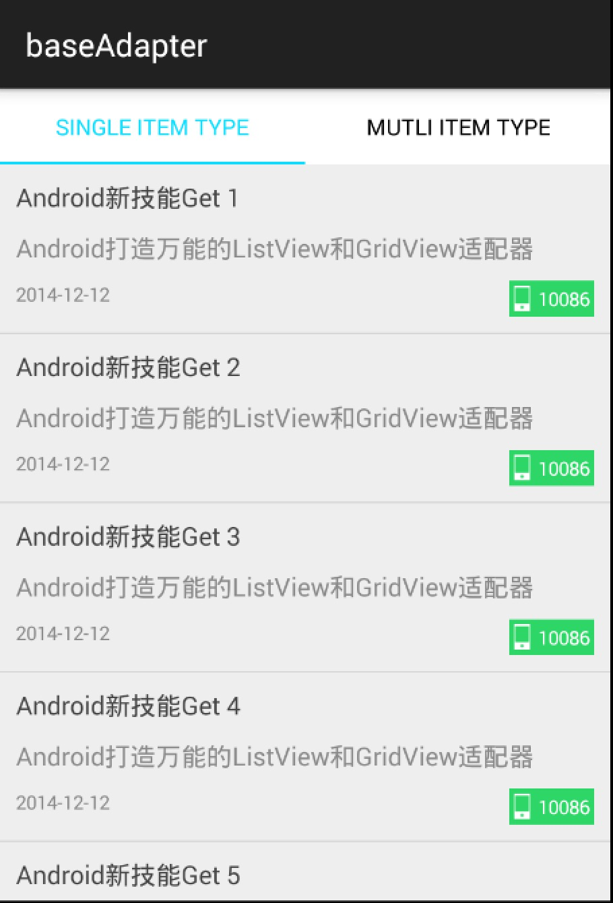
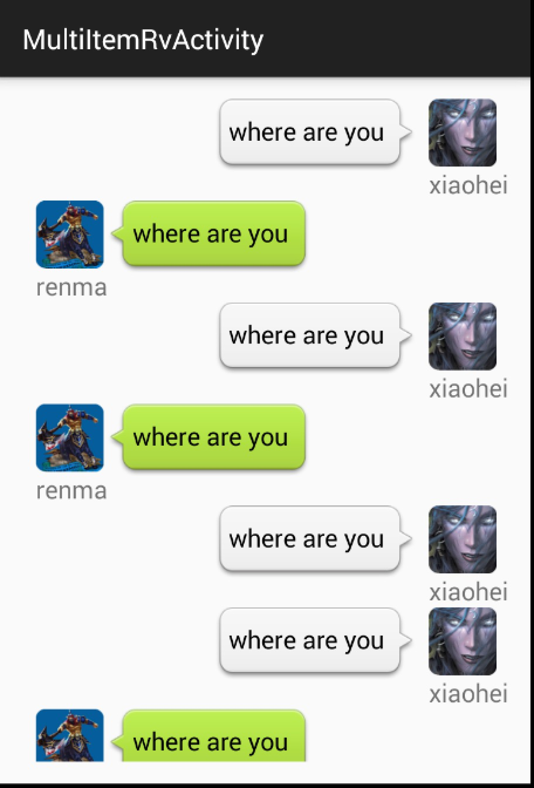
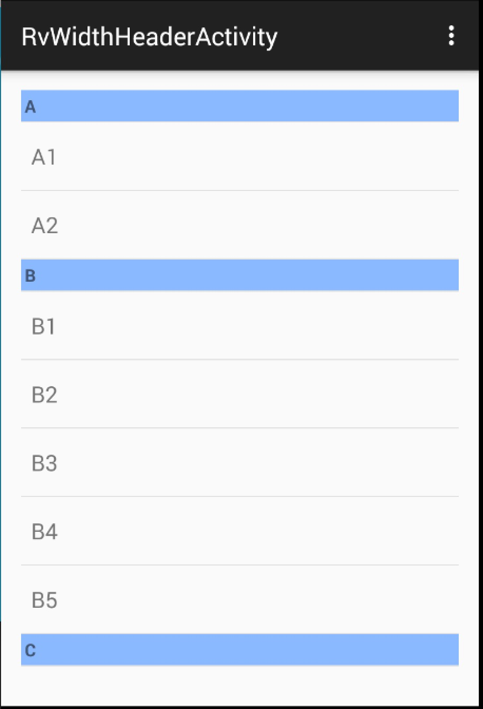

# base-adapter
Android 万能的Adapter for ListView,RecyclerView,GridView等，支持多种Item类型的情况。

[点击查看简单介绍](http://blog.csdn.net/lmj623565791/article/details/51118836)

## 引入

```
compile 'com.zhy:base-adapter:2.0.0'
```

## 使用

##（1）简单的数据绑定

首先看我们最常用的单种Item的书写方式：

```
mRecyclerView.setAdapter(new CommonAdapter<String>(this, R.layout.item_list, mDatas)
{
    @Override
    public void convert(ViewHolder holder, String s)
    {
        holder.setText(R.id.id_item_list_title, s);
    }
});
```
是不是相当方便，在convert方法中完成数据、事件绑定即可。


只需要简单的将Adapter继承CommonAdapter，复写convert方法即可。省去了自己编写ViewHolder等大量的重复的代码。

* 可以通过holder.getView(id)拿到任何控件。
* ViewHolder中封装了大量的常用的方法，比如holder.setText(id,text)，holder.setOnClickListener(id,listener)等，可以支持使用。

效果图：



##（2）多种ItemViewType

多种ItemViewType，正常考虑下，我们需要根据Item指定ItemType，并且根据ItemType指定相应的布局文件。我们通过`MultiItemTypeSupport `完成指定：

```
MultiItemTypeSupport  multiItemSupport = new MultiItemTypeSupport<ChatMessage>()
{
    @Override
    public int getLayoutId(int itemType)
    {
       //根据itemType返回item布局文件id
    }

    @Override
    public int getItemViewType(int postion, ChatMessage msg)
    {
       //根据当前的bean返回item type
    }
}

```
剩下就简单了,将其作为参数传入到`MultiItemCommonAdapter `即可。

```
mRecyclerView.setAdapter(new SectionAdapter<String>(this, mDatas, multiItemSupport)
{
    @Override
    public void convert(ViewHolder holder, String s)
    {
        holder.setText(R.id.id_item_list_title, s);
    }
});
```


贴个效果图：



##(3)添加分类header
其实属于多种ItemViewType的一种了，只是比较常用，我们就简单封装下。

依赖正常考虑下，这种方式需要额外指定header的布局，以及布局中显示标题的TextView了，以及根据Item显示什么样的标题。我们通过`SectionSupport `对象指定：

```
SectionSupport<String> sectionSupport = new SectionSupport<String>()
{
    @Override
    public int sectionHeaderLayoutId()
    {
        return R.layout.header;
    }

    @Override
    public int sectionTitleTextViewId()
    {
        return R.id.id_header_title;
    }

    @Override
    public String getTitle(String s)
    {
        return s.substring(0, 1);
    }
};
```
3个方法，一个指定header的布局文件，一个指定布局文件中显示title的TextView，最后一个用于指定显示什么样的标题（根据Adapter的Bean）。

接下来就很简单了：

```
mRecyclerView.setAdapter(new SectionAdapter<String>(this, R.layout.item_list, mDatas, sectionSupport)
{
    @Override
    public void convert(ViewHolder holder, String s)
    {
        holder.setText(R.id.id_item_list_title, s);
    }
});
```
这样就完了，效果图如下：




ListView的使用与RecyclerView基本一致，注意ListView对应的类路径为`com.zhy.base.adapter.abslistview`.
